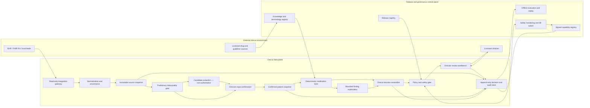
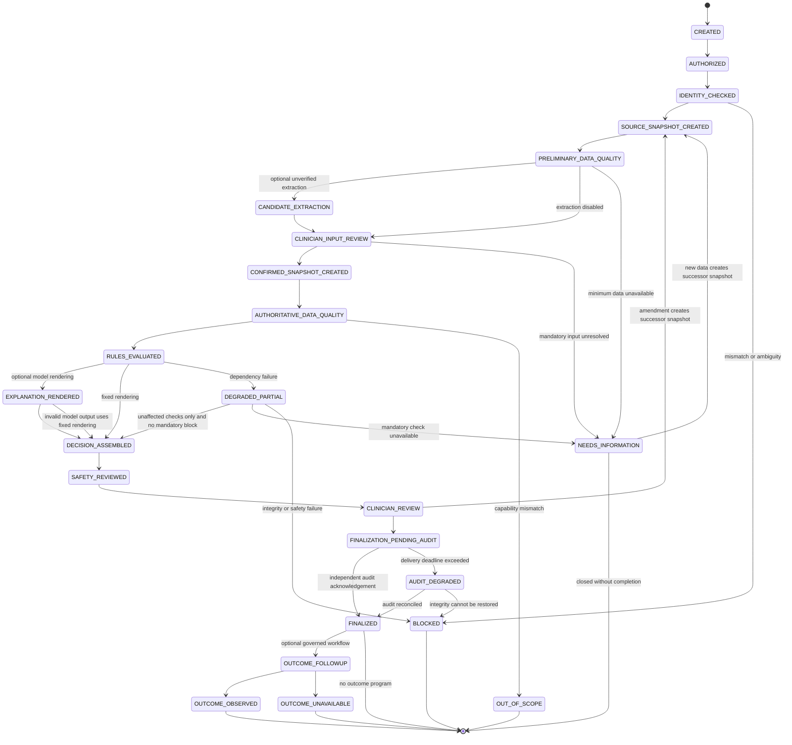
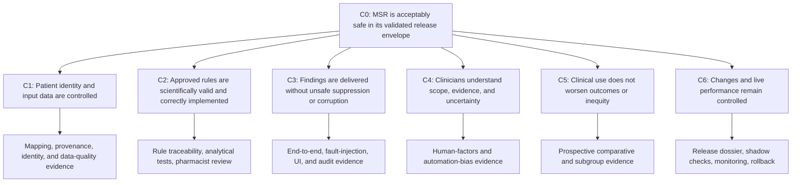
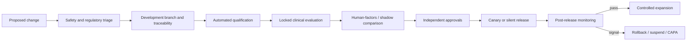

# AI Doctor OS — Safer Product and Architecture Blueprint v2

**Status:** preclinical design baseline  
**Date:** 2026-08-11  
**Initial product:** Medication Safety Review (MSR)  
**Audience:** product, clinical, pharmacy, safety, quality, regulatory, security, data, and engineering teams

This blueprint replaces the original “general autonomous doctor” starting point with a bounded clinical product and a reusable safety platform. It is an engineering and product plan, not clinical or legal advice. Product classification and clinical thresholds must be confirmed by qualified clinical, quality, and regulatory owners in each jurisdiction.

---

## 1. Executive decision

Do not begin by building an autonomous general doctor.

Build two things deliberately:

1. **A reusable clinical-safety platform** for sourced patient state, deterministic rules, evidence, permissions, immutable decisions, audit, evaluation, and controlled releases.
2. **One narrow clinical product** that uses that platform and can be validated end to end.

The first product should be a clinician-facing, read-only medication-safety workbench for adult care transitions. It is useful, measurable, data-accessible, and appropriately bounded for early clinical evaluation.

The long-term “AI Doctor OS” remains a platform direction. It is not a single product claim, regulatory clearance, autonomy level, or model.

Phase 0 must select exactly one initial launch jurisdiction: a named US state and site **or** Great Britain. Northern Ireland and the EU are out of scope until separately assessed; they must not be treated as interchangeable with Great Britain.

### 1.1 Initial intended-use statement

> For licensed pharmacists and physicians authorized by the deploying organization to perform medication review for adults aged 18 years or older during admission, discharge, transfer, or a structured outpatient medication review, Medication Safety Review assembles a candidate medication-reconciliation worklist from available patient-record data. After the clinician confirms the medication list and each rule-specific required input, it identifies potential medication discrepancies, duplicate therapies, drug allergies, interactions, contraindications, renal or hepatic dose concerns, and monitoring gaps using configured authoritative knowledge sources. It shows the patient-specific inputs and evidence supporting each finding. The authorized clinician independently reviews every finding and remains responsible for all clinical decisions and orders.

Before authoritative rule evaluation, output is limited to candidate reconciliation items with source spans. It cannot state or imply that a medication-safety finding has been established.

### 1.2 Explicit non-goals for v1

MSR does not:

- diagnose disease;
- prescribe, discontinue, or change a medication;
- place or modify an EHR order;
- triage emergencies;
- select treatment;
- communicate treatment instructions to patients;
- claim a patient or medication plan is “safe”;
- operate on pediatric, known or suspected pregnancy, emergency, or other excluded populations unless explicitly added through a separate validated capability envelope;
- learn or update itself from production interactions;
- browse the public web during a clinical case;
- use a language model as the source of a safety rule or severity classification.

### 1.3 Initial clinical claim

The first claim to investigate is:

> In the validated population, setting, and release envelope, MSR improves detection of pre-specified clinically important medication-safety risks relative to the current medication-review workflow without causing unacceptable alert burden, unsafe clinician reliance, or loss of clinician control.

This is a hypothesis until supported by analytical, human-factors, prospective, and clinical evidence.

---

## 2. Product portfolio, not one universal doctor

A shared platform may power multiple clinical products, but each product needs a separate intended use, risk file, evidence set, release line, labeling, regulatory analysis, and operational owner.

| Product line | Earliest viable status | Permitted output | Separate evidence required |
|---|---|---|---|
| Record normalization and sourced chart timeline | Platform capability | Sourced facts and conflicts | Data integrity and usability |
| Medication Safety Review | First clinical product | Potential findings and review questions | Medication-specific safety and clinical evaluation |
| Evidence-backed guideline navigator | Later | Search and source comparison | Retrieval fidelity, coverage, human factors |
| Task-specific risk prediction | Separate product | Validated risk estimate for one decision | Prediction-model and clinical-impact evidence |
| Patient symptom intake and routing | Separate higher-risk product | Conservative intake and navigation | Patient comprehension, triage safety, emergency escape paths |
| Diagnosis support | Separate regulated program | Bounded differential and investigation support | Specialty, population, and workflow-specific prospective evidence |
| Protocol-bounded workflow automation | Last, if ever | Reversible task or draft under a named protocol | Prospective evidence, site validation, action authority, liability controls |

Never market the platform as “doctor-level,” “100% reliable,” or an autonomous clinician. Claims and UI language are part of the product behavior.

---

## 3. Non-negotiable architectural invariants

These rules apply to every product built on the platform.

1. **The EHR remains the external system of record.** The platform stores versioned snapshots and decisions, not an unsourced replacement medical record.
2. **No prose is authoritative.** Structured facts, findings, rules, evidence, permissions, and dispositions are authoritative. Prose is a rendering.
3. **Models are untrusted advisers.** A model cannot grant permission, change a canonical fact, suppress a hard finding, set clinical severity, or execute a clinical action.
4. **Every clinical output is within a signed capability envelope.** User, population, setting, inputs, outputs, exclusions, performance, and release versions must match.
5. **Missing or contradictory data are first-class states.** The system must return “unable to assess” or a scoped coverage statement, never fabricate completeness.
6. **Negative assurance is prohibited.** Say “no finding among checked rules for snapshot X; allergy status unknown,” not “safe” or “no interaction.”
7. **Production artifacts are frozen and versioned.** Models, prompts, rules, terminology, knowledge, mappings, thresholds, UI, and policies change only through controlled releases.
8. **A clinical decision must be reconstructable.** Retained inputs, outputs, and artifact versions must reproduce the decision record. Deterministic components must replay exactly; preserved third-party model output is the evidence because rerunning a nondeterministic model is not assumed to reproduce it.
9. **Failure is explicit and safe.** Identity ambiguity, stale knowledge, corrupt inputs, unavailable dependencies, or schema failure leads to a blocked or degraded state.
10. **Human review is a state-machine transition.** It is not a disclaimer or optional UI behavior.
11. **Autonomy is granted per action, not per system.** Authority depends on harm, reversibility, input quality, evidence, site readiness, and monitoring.
12. **Evaluation is independent of generation.** Model self-critique and same-model voting are not release evidence.

---

## 4. System context and trust boundaries



### 4.1 Authority matrix

| Component | May do | Must never do | Failure posture |
|---|---|---|---|
| Integration gateway | Read explicitly approved resources and record source metadata | Request broad access by convenience; write EHR data | Deny and report incomplete input |
| Normalizer | Map codes, units, times, and source fields; preserve ambiguity | Convert uncertain free text into a verified fact | Create an unverified candidate or conflict |
| Patient snapshot service | Build immutable, versioned case snapshots | Decide which contradictory clinical assertion is true without policy or review | Mark conflict and block dependent checks |
| Data-quality gate | Enforce identity, completeness, recency, and supported-population requirements | Infer missing values | `NEEDS_INFORMATION` or `BLOCKED` |
| Deterministic rule engine | Apply approved, versioned rules and calculators | Invent a rule, indication, or clinical fact | Produce rule-specific unavailable/unchecked coverage |
| Bounded model service | Extract candidates, cluster duplicates, identify missing information, render sourced explanations | Set severity, alter a rule, access arbitrary tools, issue actions | Discard invalid output; retain deterministic result |
| Decision assembler | Combine typed findings, coverage, evidence, and missing data | Convert unverified candidates to facts | Reject nonconforming inputs |
| Safety gate | Enforce capability and output permissions; block unsafe states | Be bypassed by model, UI, operator, or prompt | Fail closed |
| Clinician UI | Show evidence, conflicts, coverage, and disposition controls | Hide unknowns; imply approval or certainty | Require manual workflow when unavailable |
| Audit service | Preserve immutable trace and reviewer disposition | Rewrite or delete historical clinical decisions | Block finalization if audit commit fails |
| Evaluation service | Replay releases offline and compare outcomes | affect a live clinical decision | Isolated from production authority |

---

## 5. Runtime workflow

### 5.1 Clinical case state machine



There is no arbitrary agent loop. Each transition has typed preconditions, a deadline, retry limits, an owner, and an auditable result. `NEEDS_INFORMATION` is resumable: new source data or clinician correction creates a successor snapshot rather than mutating the prior one. Outcome follow-up is asynchronous, optional, based on a defined lawful purpose and follow-up window, and never required to finalize the clinical review; missing outcome is recorded explicitly rather than treated as a good outcome.

Degraded mode may reach clinician review only when the decision identifies every evaluated and unavailable rule, every unavailable dependency is unrelated to the displayed findings, and no mandatory or hard-blocking condition remains. Otherwise the case remains `NEEDS_INFORMATION` or `BLOCKED`.

### 5.2 End-to-end sequence

1. The clinician launches MSR from a bound patient and encounter context.
2. The gateway validates tenant, user, role, patient, encounter, consent or other access basis, and requested capability.
3. The integration adapter retrieves the minimum required read-only FHIR and local data.
4. Raw source artifacts are hashed and stored in an encrypted source vault or referenced immutably when local retention is prohibited.
5. Normalization maps medications, allergies, conditions, observations, units, and time semantics while preserving exact source provenance.
6. The snapshot service creates an immutable source snapshot. Contradictions coexist; they are not silently resolved.
7. Preliminary data-quality checks run. A pre-confirmation model may extract only `inferred_candidate` facts with source spans for the reconciliation worklist.
8. The clinician confirms, corrects, or disputes the medication list and every rule-specific required input. Any correction creates a new clinician-verified fact and successor snapshot.
9. Authoritative data-quality checks apply rule-specific input contracts for provenance, verification, units, recency, temporal overlap, source precedence, and required semantic states.
10. The deterministic rule engine evaluates the signed rule and knowledge releases against the confirmed snapshot. Every requested rule produces an explicit evaluation result, including when it was not assessed.
11. A separate post-rule model may render explanations only from signed findings. It cannot add clinical assertions; fixed rendering remains available.
12. The decision assembler creates a typed decision package with findings, per-rule coverage, unknowns, evidence, and hard blocks.
13. The safety gate applies the capability envelope and blocks prohibited outputs or incomplete mandatory checks.
14. The clinician sees the workbench, reviews evidence, and records acknowledge, reject, amend, or defer with the required rationale and ownership.
15. The decision, review disposition, and audit outbox commit transactionally. The UI reports that the review is recorded but finalization is pending until the independent immutable audit sink acknowledges it. A delivery deadline breach enters `AUDIT_DEGRADED` and triggers the configured containment policy without losing the clinician’s recorded review.
16. Safety telemetry receives non-PHI metrics; sampled cases enter governed adjudication, never automatic training.

---

## 6. Component architecture

Start as a **modular monolith** with explicit module boundaries, one relational database, object storage, and a durable job mechanism. Do not begin with a specialist-agent mesh, Kafka, a graph database, or Kubernetes-scale microservices.

| Module | Responsibility | Source of truth | Initial implementation posture |
|---|---|---|---|
| Identity and access | SSO, roles, tenant and patient context, least privilege | Enterprise identity provider and EHR launch context | OIDC/SMART-style scopes; short-lived credentials |
| Clinical integration | FHIR/local reads, source manifests, retry and partial-response handling | EHR and approved local systems | Adapter interface per site; read-only scopes |
| Source vault | Raw source hash, metadata, retention, replay pointer | Original artifact or immutable copy | Encrypted object storage; customer-specific retention |
| Terminology normalization | Medication, condition, lab and unit mapping | Signed terminology release | Versioned pure transformations with mapping evidence |
| Patient snapshot | Immutable facts, conflicts, temporal state, coverage | Versioned relational records | PostgreSQL temporal/event pattern; no graph database initially |
| Data-quality gate | Required inputs, identity, recency, scope, conflict policy | Capability registry and snapshot | Deterministic policy functions |
| Clinical rules | Medication-safety evaluation | Licensed drug knowledge and approved local policy | Deterministic, independently testable rule adapters |
| Evidence registry | Source, version, jurisdiction, applicability, expiry, license | Signed knowledge bundle | No live public-web retrieval in clinical runtime |
| Model gateway | Approved models, prompts, schemas, privacy routing | Signed model release | No tool or database access; strict typed responses |
| Decision assembler | Findings, coverage, evidence, unknowns, rendering inputs | Typed decision schema | Rejects unsupported or untraceable claims |
| Safety-policy gate | Capability, output, population and action enforcement | Signed capability release | Independent of model path; fail closed |
| Review workbench | Human confirmation, evidence inspection and disposition | Final decision and review records | Accessible, role-aware, no “AI approved” language |
| Audit and reconstruction | Transactional event outbox, release pins, retained model artifacts, deterministic replay | Signed decision trace | Independently controlled immutable retention and tamper evidence |
| Evaluation | Regression, locked validation, subgroup and release gates | Validation corpus and release dossier | Offline and isolated from live authority |
| Monitoring | Reliability, data quality, alert burden, overrides, incidents | Telemetry and adjudicated signals | Capability-specific kill switch |

### 6.1 Why a modular monolith first

- Clinical consistency and transactions matter more than independent scale.
- A small team can reason about one deployment and one schema.
- Exact replay is easier when versions and events share a transactional boundary.
- Premature service boundaries create distributed failure modes and a larger validation surface.
- Modules can later be extracted only when throughput, isolation, vendor, or regulatory boundaries justify it.

### 6.2 Recommended initial stack

- Python application with FastAPI and strict schema validation.
- PostgreSQL for canonical state, decisions, releases, and workflow transitions.
- Encrypted object storage for source artifacts and validation evidence.
- A durable job queue for ingestion and bounded model calls.
- OpenTelemetry-compatible traces and metrics with PHI-safe logging.
- Containerized deployment, infrastructure as code, signed builds, and a software bill of materials.
- FHIR R4-facing adapters because current production ecosystems commonly depend on R4 profiles; keep the internal model independent of a single FHIR release.
- SMART/OIDC-style scoped authorization for EHR integration.
- Licensed jurisdiction-specific drug knowledge; do not use an LLM or a public search index as the drug database.

Defer Redis, Kafka, Kubernetes, a feature store, a vector database, and a knowledge graph until a measured requirement exists.

---

## 7. Canonical data model

FHIR is an integration contract, not the internal truth model. Internal records must preserve clinical temporality, uncertainty, conflicts, source identity, and release versions in a form optimized for safety and replay.

### 7.1 Core entities

```text
Tenant
  tenant_id, jurisdiction, site_config_release, data_residency

PatientRef
  tenant_id, external_patient_id, identity_assertions,
  identity_match_status, encounter_context

SourceArtifact
  artifact_id, artifact_type, source_system, source_resource_id,
  source_version, authored_at, retrieved_at, content_hash,
  access_scope, retention_policy, encrypted_location

ClinicalFact
  fact_id, patient_ref, fact_kind, normalized_code, value_json, unit,
  effective_time_range, recorded_at, source_artifact_id,
  extraction_method, verification_status, confidence,
  state_version, conflict_group_id, supersedes_fact_id

ClinicalSemanticState
  fact_id, semantic_type, semantic_value
  examples:
    allergy_status = no-known-allergies | unknown | not-recorded |
                     patient-denies | positive-history | conflicted
    pregnancy_status = excluded-known-or-suspected | unknown | not-applicable

MedicationAssertion
  fact_id, ingredient_code, product_code, display_name, dose,
  dose_unit, route, frequency, indication, start_time, end_time,
  medication_status, reconciliation_status

ReconciliationItem
  item_id, candidate_medication_identity, source_assertion_fact_ids,
  discrepancy_types, last_confirmed_at, confirmation_source,
  completeness_status, clinician_resolution, successor_item_id

  completeness_status = confirmed | incomplete | uncertain | conflicted

CaseSnapshot
  snapshot_id, patient_ref, encounter_ref, capability_id,
  fact_ids, source_manifest_hash, data_quality_results,
  created_at, immutable_signature

KnowledgeRelease
  release_id, provider, jurisdiction, content_types, version,
  effective_date, expiry_date, license, approval_record, signature

RuleInputContract
  contract_id, rule_id, rule_release, required_fact_types,
  accepted_verification_states, required_codes, units,
  maximum_age, temporal_overlap_policy, source_precedence_policy,
  minimum_data_policy, unsupported_population_policy

RuleEvaluation
  evaluation_id, snapshot_id, rule_id, rule_release,
  input_contract_id, result,
  required_fact_ids, observed_fact_ids, missing_fact_types,
  applicability, freshness_status, evidence_refs, trace_ref,
  elapsed_time, error_code, created_at

  result = FINDING | EVALUATED_NO_FINDING | NOT_APPLICABLE |
           NOT_ASSESSED | RULE_UNAVAILABLE | INPUT_CONFLICT |
           STALE_INPUT | EXECUTION_ERROR

SafetyFinding
  finding_id, finding_type, rule_id, rule_version, severity,
  snapshot_id, rule_evaluation_id, trigger_fact_ids, evidence_refs, missing_inputs,
  status, coverage, created_at

ModelContribution
  contribution_id, purpose, model_release, prompt_release,
  input_hash, candidate_facts, explanation_claims,
  schema_status, abstention_reason, created_at

ClinicalDecision
  decision_id, case_id, snapshot_id, capability_release,
  workflow_release, knowledge_release_ids, model_release_ids,
  findings, coverage, missing_information, hard_blocks,
  allowed_review_actions, status, immutable_signature

ReviewDisposition
  decision_id, reviewer_id, reviewer_role,
  disposition, amendments, rationale_code, rationale_text, follow_up_owner,
  follow_up_due_at, timestamp

AuditEvent
  event_id, correlation_id, actor, event_type, object_ref,
  prior_event_hash, payload_hash, occurred_at
```

### 7.2 Verification states

Use explicit, non-overlapping states:

- `source_verified`: faithfully imported from a named source, not necessarily clinically correct;
- `clinician_verified`: confirmed by an authorized clinician for this review;
- `patient_reported`: reported by the patient and not independently confirmed;
- `inferred_candidate`: extracted or inferred and not eligible to drive a hard recommendation;
- `conflicted`: materially inconsistent with another current assertion;
- `superseded`: replaced by a newer traceable assertion;
- `retracted`: invalidated while retained for audit.

Never use a floating-point confidence score to replace these semantic states.

Every requested rule creates a `RuleEvaluation`, even when it does not create a `SafetyFinding`. This makes checked, not-applicable, not-assessed, stale, conflicted, unavailable, and failed states distinguishable. A decision-level coverage summary is derived from these rule evaluations; it is not a substitute for them.

A `RuleInputContract` defines the exact facts required by one rule. For example, a renal-dose rule may require confirmed medication identity, dose, route, an eGFR value with unit and observation time, and an approved recency window. An interaction rule requires active medication assertions with a defined temporal-overlap policy. A drug–allergy rule distinguishes `no-known-allergies`, `unknown`, `not-recorded`, `patient-denies`, and a positive allergy history. A copied-forward condition is not automatically sufficient for a drug–disease rule.

### 7.3 Clinical decision object example

```json
{
  "schema_version": "msr-decision-1.0",
  "decision_id": "uuid",
  "case_id": "uuid",
  "capability": {
    "id": "medication-safety-adult-transition",
    "release": "1.0.0",
    "human_review": "required"
  },
  "patient_snapshot": {
    "id": "uuid",
    "source_manifest_hash": "sha256:...",
    "medications_confirmed": true,
    "allergies_confirmed": false,
    "renal_data_status": "current",
    "hepatic_data_status": "missing"
  },
  "coverage": {
    "checked": ["duplicate-ingredient", "renal-dose"],
    "not_checked": ["drug-allergy", "hepatic-dose"],
    "reason_not_checked": [
      "allergy status not clinician-confirmed",
      "required hepatic data unavailable"
    ]
  },
  "rule_evaluations": [
    {
      "evaluation_id": "uuid",
      "rule_id": "renal-dose-rule-123",
      "result": "FINDING",
      "input_contract": "renal-dose-inputs-1",
      "observed_fact_ids": ["medication-fact", "egfr-fact"]
    },
    {
      "evaluation_id": "uuid",
      "rule_id": "drug-allergy-rule-set",
      "result": "NOT_ASSESSED",
      "missing_fact_types": ["clinician-confirmed-allergy-status"]
    }
  ],
  "findings": [
    {
      "finding_id": "uuid",
      "rule_evaluation_id": "uuid",
      "type": "drug-renal-dose-review",
      "severity": "high",
      "authoritative_rule": "drug-kb-2026.08:rule-123",
      "trigger_fact_ids": ["medication-fact", "egfr-fact"],
      "evidence_refs": ["evidence-record"],
      "review_question": "Verify current renal function and dose appropriateness."
    }
  ],
  "hard_blocks": [],
  "model_rendering": {
    "status": "supplemental",
    "release": "explanation-model-2",
    "unsupported_claims": 0
  },
  "review": {
    "status": "pending",
    "allowed_dispositions": ["acknowledge", "reject", "amend", "defer"]
  },
  "release_manifest_hash": "sha256:...",
  "audit_hash": "sha256:..."
}
```

The authoritative finding must remain usable if model rendering is disabled.

---

## 8. Capability registry

The capability registry turns scope and autonomy into executable policy.

```yaml
capability_id: medication-safety-adult-transition
release: 1.0.0
status: shadow
jurisdiction: us-pilot-site-1
site_profile_release: site-1-fhir-mapping-1.0.0
retention_policy: site-1-clinical-retention-1
users:
  - licensed-pharmacist
  - licensed-physician
population:
  minimum_age: 18
  exclusions:
    - emergency-use
    - known-or-suspected-pregnancy
settings:
  - admission
  - discharge
  - transfer
required_inputs:
  - bound-patient-and-encounter
  - clinician-confirmed-medication-list
rule_catalog:
  - rule_id: duplicate-ingredient
    input_contract: duplicate-ingredient-inputs-1
  - rule_id: drug-allergy
    input_contract: drug-allergy-inputs-1
  - rule_id: renal-dose-review
    input_contract: renal-dose-inputs-1
allowed_outputs:
  - potential-safety-finding
  - medication-discrepancy-candidate
  - missing-information-request
  - review-worklist
prohibited_outputs:
  - diagnosis
  - prescription
  - medication-change-order
  - emergency-triage
  - patient-treatment-instruction
human_review: required
disposition_policy: msr-disposition-policy-1
high_severity_second_review: site-policy
review_sla: site-policy
overdue_escalation: site-policy
write_authority: none
knowledge_release: drug-kb-2026-08-01
knowledge_expiry_behavior: affected-rules-not-assessed
rule_release: msr-rules-1.0.0
model_releases:
  extraction: med-extraction-3
  explanation: finding-explanation-2
rendering_release: msr-ui-renderer-1.0.0
ui_release: msr-workbench-1.0.0
manifest_signature:
  canonicalization: jcs
  key_id: release-signing-key-2026-01
  algorithm: site-approved-asymmetric-signature
kill_switch_scope:
  - global
  - tenant
  - rule-release
  - knowledge-release
  - model-release
```

The gate rejects a request that does not match the registry. An administrator cannot bypass an exclusion with a free-text override.

Registry status is operationally enforced:

- `shadow`: decisions and metrics are withheld from clinical users;
- `simulated`: available only in controlled test sessions;
- `pilot`: visible to named trained users at approved sites;
- `active`: visible within the approved production envelope;
- `suspended`: all new evaluations blocked, with manual workflow shown.

The signed manifest also pins the supported rule catalog, per-rule input contracts, site/FHIR-profile compatibility, mapping release, role-to-disposition permissions, review and overdue-escalation policy, jurisdiction, retention policy, and renderer/UI releases. There is no grace period for an expired knowledge release unless an explicit rule-level policy, risk assessment, and approval define one; affected checks otherwise become `RULE_UNAVAILABLE` or `NOT_ASSESSED`.

Unknown pregnancy status is not equivalent to absence of pregnancy. In v1, any pregnancy-dependent check becomes `NOT_ASSESSED` when status is unknown; known or suspected pregnancy places the case outside the capability envelope.

---

## 9. Deterministic and probabilistic responsibilities

### 9.1 Deterministic authority

Keep these functions deterministic and independently testable:

- patient and encounter binding;
- authorization, consent or other access-basis enforcement;
- source integrity and freshness;
- code and unit validation;
- medication ingredient normalization when mapping is unambiguous;
- approved source-precedence rules;
- duplicate-ingredient checks;
- licensed drug–drug, drug–allergy, drug–condition, dose-range, renal, hepatic, and monitoring rule application;
- validated calculators;
- severity classification supplied by the approved rule source and local policy;
- capability eligibility;
- permitted output and action checks;
- audit hashes and release pinning.

### 9.2 Permitted model assistance

Models may initially:

- extract medication candidates and source spans from unstructured text;
- identify likely duplicate mentions for human review;
- detect missing information questions;
- summarize existing sourced records;
- render concise explanations from authoritative structured findings;
- rank a worklist only after a separate calibrated-ranking validation.

Models may not:

- infer that a medication is active without marking it unverified;
- invent or select a safety rule;
- set or reduce severity;
- suppress a deterministic finding;
- create a negative assurance;
- write to an EHR or contact a patient;
- browse arbitrary sources;
- decide that the case is inside the capability envelope;
- treat model agreement as independent verification.

### 9.3 Model contract

```text
extract_reconciliation_candidates(
  minimum_necessary_source_artifacts,
  output_schema_version,
  deadline
) -> {
  candidate_facts[] {
    normalized_candidate,
    source_artifact_id,
    source_span,
    extraction_uncertainty
  },
  missing_information[],
  abstention_reason?
}

render_finding_explanation(
  signed_finding,
  allowed_fact_ids,
  allowed_evidence_ids,
  output_schema_version,
  deadline
) -> {
  explanation_claims[] {
    text,
    supporting_fact_ids[],
    evidence_ids[],
    uncertainty_label
  },
  abstention_reason?
}
```

`extract_reconciliation_candidates` runs only before clinician confirmation and creates `inferred_candidate` records. Those candidates cannot enter a rule evaluation. `render_finding_explanation` runs only after a deterministic finding exists and cannot add a new clinical assertion. A clinician amendment creates a successor snapshot and triggers a new deterministic evaluation; it never mutates a prior finding.

Runtime controls:

- no network, shell, file, EHR, database, or general tool access;
- minimum-necessary PHI and private or zero-retention inference arrangements;
- strict JSON schema and semantic validation;
- source-span requirement for extracted facts;
- server-side citation resolution;
- bounded tokens, time, and retries;
- invalid output discarded rather than repaired into a clinical assertion;
- prompts and model releases signed and pinned;
- clinical notes treated as untrusted data and isolated from instructions to resist prompt injection.

Do not log hidden chain-of-thought. Preserve structured evidence, observable rationale fields, tool results, rule traces, and output decisions instead.

---

## 10. Clinical safety architecture

### 10.1 Top-level safety case

The safety case is an evidence-backed argument, not a collection of disclaimers.



Every safety requirement must be traceable:

```text
hazard
→ foreseeable cause
→ hazardous situation
→ potential harm
→ preventive/detective control
→ implementation requirement
→ verification test
→ clinical evidence
→ residual risk
→ accountable owner and approval
```

### 10.2 Initial hazard register

| ID | Hazardous situation | Foreseeable causes | Mandatory controls | Evidence before live pilot |
|---|---|---|---|---|
| H-001 | A serious interaction or contraindication is missed | Omitted medication, failed mapping, missing knowledge, stale data, UI suppression | Cross-source discrepancy worklist; clinician confirmation; explicit `medication-list-incomplete/uncertain` state; source and last-confirmed time; signed knowledge; rule tests; prominent delivery; `cannot assess` state | Best-available adjudicated medication list; per-category sensitivity and confidence intervals; omission tests; delivery telemetry |
| H-002 | A false alert contributes to an inappropriate medication change | Wrong identity, unit error, stale result, context-insensitive rule, over-trust | Encounter binding; unit/recency validation; “review question” language; clinician decision; evidence display | False-alert burden; applicability adjudication; human-factors study |
| H-003 | Wrong-patient information is displayed | Identity merge, stale browser context, cached state | Bound launch context; identity assertions; session isolation; prominent identifiers; cache partitioning | Fault tests must reject every constructed mismatch; security review |
| H-004 | The model invents a contraindication, severity, or citation | Unsupported generation or prompt injection | Model only renders signed facts; server resolves citations; schema and claim validation; model path non-authoritative | Zero unsupported clinical claims of any severity in the locked adversarial suite |
| H-005 | Model or vendor outage hides deterministic findings | Coupled UI, timeout, exception, partial response | Independent rule result; fixed fallback rendering; degraded-state banner; bounded deadlines | Chaos and failover tests; degraded-mode usability |
| H-006 | Alert fatigue causes true findings to be ignored | Excessive low-value alerts, poor prioritization, duplicate alerts | Start with high-value rule classes; deduplication; measure burden; disposition reasons; threshold governance | Alerts per case; PPV; response time; unsafe override analysis |
| H-007 | An outdated or corrupt knowledge release changes care | Missed expiry, supplier error, unsigned update | Signed releases; effective/expiry dates; dual approval; integrity checks; rollback | Release verification and rollback drill |
| H-008 | A model or rule change regresses subgroup performance | Distribution shift, incomplete data, untested update | Locked external validation; subgroup metrics; shadow comparison; restrict envelope on failure | Predefined subgroup gates and release review |
| H-009 | “No finding” is misread as proof of safety | Unknown coverage, missing allergy/lab data, UI wording | Coverage statement; unknowns shown; negative-assurance ban | Comprehension study and UI verification |
| H-010 | A finding is acknowledged without independent review | Automation bias, rushed workflow, inaccessible evidence | Evidence-on-demand; required disposition; training; no “AI approved” labels | Simulated-use study comparing unsafe decisions with and without tool |
| H-011 | An audit or data-integrity failure makes a decision unreconstructable | Partial transaction, log loss, mutable history | Transactional decision and outbox; independently controlled immutable retention; signed checkpoints; content hashes; backup/restore | 100% reconstructability and deterministic replay completion in qualification suite |
| H-012 | Cybersecurity or availability failure causes unsafe dependence | Compromise, ransomware, altered rules, prolonged outage | Read-only least privilege; signed artifacts; manual downtime workflow; isolation; DR plan | Penetration tests, restore and downtime drills |
| H-013 | A high-severity finding is displayed but never reviewed | Workflow abandonment, notification failure, missing ownership | Named reviewer; disposition SLA; overdue escalation; handoff evidence; monitored unresolved queue | End-to-end delivery and overdue-escalation tests; live unresolved-rate monitoring |

The hazard register is a starting point. A multidisciplinary hazard workshop must expand it using actual workflow observation before code is considered complete.

### 10.3 Safety requirements

| Requirement | Rule |
|---|---|
| SAF-001 | If patient or encounter identity is ambiguous, the case is blocked and no clinical finding is rendered. |
| SAF-002 | If a rule-dependent input is missing, stale, conflicting, or unsupported, that rule returns `NOT_ASSESSED` with the exact reason. The entire case blocks only for identity, authorization, integrity, out-of-envelope use, capability-minimum data, or another signed mandatory policy. Partial results must display exact coverage, and unavailable high-risk checks require explicit acknowledgement when policy allows finalization. |
| SAF-003 | No model output can alter rule identity, severity, trigger facts, evidence source, or hard-block state. |
| SAF-004 | Every displayed clinical claim resolves to a signed finding or approved evidence record. |
| SAF-005 | The deterministic result remains visible if the model is unavailable. |
| SAF-006 | Every negative result states its checked scope, snapshot, knowledge release, and missing coverage. |
| SAF-007 | Every high-severity finding requires explicit disposition or deferral to a named owner and due time; unread or overdue findings follow a locally owned escalation policy. |
| SAF-008 | The decision, review event, and transactional audit outbox commit atomically into `FINALIZATION_PENDING_AUDIT`; `FINALIZED` requires independent immutable audit acknowledgement. Delivery failure preserves the review, enters `AUDIT_DEGRADED`, alerts operations, and applies the configured containment policy. |
| SAF-009 | Defined integrity triggers such as wrong-patient display or untraceable high-severity output cause automated temporary containment. Suspected clinical harm receives time-bounded Clinical Safety Officer triage, documented attribution assessment, and an explicit suspend, narrow, restore, or escalate decision. |
| SAF-010 | Production models, prompts, mappings, rules, thresholds, knowledge, and UI releases are frozen, signed, and rollbackable. |
| SAF-011 | Production interactions never become training labels without governed selection, de-identification, adjudication, and approval. |
| SAF-012 | The UI must identify the system as decision support and identify the responsible reviewer; it must never imply clinician certification or product assurance. |

### 10.4 Human factors and review interface

The clinician workbench should show, in this order:

1. Bound patient and encounter identity.
2. Data-quality and coverage banner: confirmed, stale, missing, or conflicting.
3. High-severity potential findings, deduplicated and prioritized.
4. For each finding: patient facts, rule source/version, clinical rationale, missing context, and a review question.
5. Lower-severity items in a non-interruptive section.
6. Explicit unchecked areas and system limitations.
7. Disposition controls: acknowledge, reject, amend, defer; standardized reason plus optional note.
8. Named follow-up owner and due time for deferral.

Do not show a generic LLM confidence percentage. Show evidence status, data status, rule applicability, and calibrated task-specific probabilities only if they have independent validation and a defined interpretation.

Disposition semantics are strict:

- `acknowledge` means the clinician acknowledges a potential finding for clinical review; it never means accepting an AI-recommended medication change;
- `reject` requires a standardized reason such as inapplicable rule, incorrect source data, or completed clinical review;
- `amend` never mutates a fact or finding—it creates a clinician-verified successor fact and snapshot, then re-runs every dependent rule;
- `defer` requires a named owner, due time, handoff evidence, and overdue escalation;
- high-severity rejection or deferral follows the second-review or override policy approved for the site.

---

## 11. Knowledge and evidence architecture

### 11.1 Source hierarchy

Clinical runtime may use only approved, licensed, versioned sources appropriate to the jurisdiction and intended use, such as:

- authoritative drug-interaction and contraindication databases;
- national medication terminology and product dictionaries;
- regulator-approved labeling;
- locally approved formulary and policies;
- selected professional guidelines with documented review and licensing;
- validated calculators and reference ranges.

Primary literature search is an offline evidence-maintenance workflow in v1, not a live clinical tool.

### 11.2 Knowledge release object

Each release records:

```text
provider and license
jurisdiction and target population
content types and coverage
source versions and publication dates
effective and expiry dates
mapping and transformation code version
clinical reviewer and approval record
known conflicts and limitations
integrity hash and signature
rollback predecessor
```

Each jurisdiction has a named clinical-content owner. The owner monitors supplier safety notices, recalls, labeling changes, terminology changes, and local formulary conflicts; assesses urgency; approves routine releases; and activates an urgent-content path when delay could create risk. A rule or knowledge release can be disabled independently of the whole capability. Customer notification, affected-decision identification, reportability assessment, and retrospective review are defined before launch.

### 11.3 Evidence claims

Every evidence-backed statement must resolve server-side to:

```text
claim
→ authoritative finding or evidence record
→ exact source and version
→ relevant section or structured rule
→ applicable patient facts
→ contradictory or missing context
→ jurisdiction
→ review date
```

Do not allow a generated URL, citation label, or quotation to pass through without resolution and validation.

### 11.4 Terminology strategy

- Preserve source codes and displays exactly.
- Normalize to a jurisdiction-appropriate medication ingredient/product vocabulary.
- Version every terminology release and local mapping.
- Treat ambiguous mappings as candidates requiring review.
- Test brand/generic equivalence, combination products, salts, routes, units, PRN status, holds, discontinuations, and historical orders.
- Keep local formulary and organizational policy separate from scientific drug knowledge so conflicts are visible.

---

## 12. API and event contracts

All internal APIs are versioned, typed, idempotent, and correlation-ID aware. Clinical writes require optimistic concurrency against the expected state version.

```text
POST /v1/cases
  input: patient_ref, encounter_ref, capability_id, source_manifest
  output: case_id, workflow_state, snapshot_version

POST /v1/cases/{case_id}/artifacts
  input: source metadata and encrypted artifact pointer
  output: artifact_id, ingestion_status, integrity_status

POST /v1/cases/{case_id}/confirm-inputs
  input: expected_snapshot_version, confirmed facts, disputed facts, reviewer
  output: new_snapshot_version, unresolved_conflicts

POST /v1/cases/{case_id}/evaluate
  input: expected_snapshot_version, capability_release, idempotency_key
  output: decision_id, workflow_state, hard_block_count, coverage

GET /v1/decisions/{decision_id}
  output: typed ClinicalDecision and render-safe evidence packet

POST /v1/decisions/{decision_id}/review
  input: expected_decision_version, disposition, amendments,
         rationale, follow_up_owner, follow_up_due_at
  output: finalized decision or next required transition

POST /v1/replay/{decision_id}
  authority: privileged offline evaluation only
  output: reconstructed decision, deterministic-replay result,
          retained model artifacts, and divergence report
```

### 12.1 Event envelope

```json
{
  "event_schema": "clinical-event-1.0",
  "event_id": "uuid",
  "event_type": "decision.safety_reviewed",
  "correlation_id": "uuid",
  "tenant_id": "opaque-id",
  "case_id": "uuid",
  "object_version": 7,
  "actor": {"type": "service", "id": "safety-gate"},
  "release_manifest_hash": "sha256:...",
  "payload_hash": "sha256:...",
  "previous_event_hash": "sha256:...",
  "occurred_at": "2026-08-11T12:00:00Z"
}
```

Keep PHI out of general telemetry. Clinical payloads belong in the protected clinical data plane; telemetry references opaque IDs and hashes.

### 12.2 Audit integrity and retention

A database hash chain alone is not tamper-resistant because an actor able to rewrite the database could recompute it. Use all of the following:

1. Write the clinical decision, review disposition, and an audit outbox row in one database transaction.
2. Deliver the outbox event to WORM-capable storage or an independently controlled audit sink.
3. Create periodic signed or Merkle-root checkpoints with key ID, signing algorithm, trusted clock source, and verification record.
4. Reconcile the transactional outbox against the independent sink and alert on gaps, duplicates, reordering, or clock anomalies.
5. Verify audit history during backup-restore drills.
6. Preserve actor and workload identity, authorization decision, and configuration/release references.

Append-only audit history does not mean retaining all PHI forever. Each tenant has a documented retention, correction, access, deletion, legal-hold, and return/destruction policy consistent with the organization’s role and jurisdiction. Corrections create linked successor records and audit events rather than overwriting prior decisions. Where lawful deletion applies, protected clinical payloads follow the approved deletion process while the minimum permitted accountability record is retained according to policy.

---

## 13. Evaluation and evidence program

### 13.0 Comparator and primary endpoint contract

Before data are analyzed, the protocol must name:

- **Comparator:** the pilot site’s usual pharmacist-led or clinician-led medication-reconciliation workflow, including any existing interaction tooling, performed without MSR. The exact workflow and user roles must be documented rather than labeled generically as “standard care.”
- **Reference standard:** an adjudicated best-available medication list and rule-applicability assessment assembled across approved sources; the EHR active-medication list is not ground truth.
- **Pre-specified rule classes:** the exact high-harm categories included in the claim and the rationale for their inclusion.
- **Primary analytical endpoint:** per-class sensitivity for applicable high-severity findings against the adjudicated reference, with a pre-specified clinical safety margin and confidence interval.
- **Primary human-factors safety endpoint:** unsafe clinician-disposition rate with MSR versus the comparator workflow in simulated use.
- **Primary prospective endpoint:** selected before the study from clinically important discrepancy detection, time to correct review action, or another patient/workflow-relevant measure appropriate to the design.

“Clinically important,” severity, applicability, comparator, analysis population, and missing-data handling cannot be decided after results are seen.

### 13.1 Three separate data products

1. **Development corpus:** governed, de-identified or synthetic-as-appropriate data for mappings, UI, rules, and model development.
2. **Locked validation corpus:** time-separated and external-site data never used for development or tuning.
3. **Prospective evidence registry:** protocol-defined live cases, dispositions, adjudication, incidents, outcomes, and data-access records.

Synthetic cases are valuable for boundary and fault injection. They do not prove clinical benefit.

### 13.2 Reference standard and adjudication

- Two independent clinical pharmacists adjudicate medication list, rule applicability, severity, and appropriate review question.
- A physician adjudicates ties or issues requiring broader clinical context.
- Preserve disagreement as `certain`, `context-dependent`, or `unresolvable-from-record`.
- Do not use “what the clinician did” as the sole ground truth.
- Separate scientific rule validity, software analytical correctness, and real-world clinical usefulness.

The corpus must include common and high-harm medications, polypharmacy, renal and hepatic impairment, allergies, care homes, fragmented prescribing, combination products, missing dose/route, contradictory sources, copied-forward records, stale lists, discontinuations, holds, PRN medicines, unit corruption, threshold cases, and identity collisions.

### 13.3 Dataset partitioning

- Split by patient before any case construction.
- Maintain temporal holdout to test evolving practice and data drift.
- Maintain at least one external-site holdout.
- Prevent source-document duplicates and near-duplicates across splits.
- Stratify by site, setting, medication burden, data completeness, age, sex, language, ethnicity where lawful and appropriate, disability, comorbidity, renal function, and other clinically relevant groups.
- Lock the test protocol, analysis code, thresholds, and model release before evaluation.

### 13.4 Metrics

| Domain | Required metrics |
|---|---|
| High-harm detection | Sensitivity and false-negative rate per finding class with 95% confidence intervals |
| Precision and burden | PPV, alerts per patient/review, number needed to review, duplicate-alert rate |
| Data integrity | Identity error rate, medication mapping accuracy, unit accuracy, stale/missing-data abstention recall |
| Clinical correctness | Rule applicability and severity agreement; correct trigger-fact extraction |
| Calibration | Reliability curve, Brier score or task-appropriate calibration error for any probabilistic ranker |
| Human factors | Correct disposition, time to disposition, evidence comprehension, unsafe reliance, override reason |
| Reliability | End-to-end availability, latency, stale-result rate, fallback success, audit completeness |
| Equity | Sensitivity, PPV, abstention, missingness, and burden by pre-specified subgroup |
| Clinical value | Reconciliation completion, time to risk detection, clinically important discrepancies found, downstream medication-related harm in an adequately powered study |

Never pool a severe category with many easy low-risk cases to hide a dangerous false-negative rate.

### 13.5 Provisional release-gate shape

Final numerical thresholds require clinical and statistical approval, but every release must at minimum demonstrate:

- 100% traceability for every released rule and implemented clinical-claim path to an approved source, implementation, and test—without implying complete medication-safety coverage;
- 100% decision reconstructability and exact replay of deterministic paths in release qualification;
- rejection of every constructed wrong-patient case in the identity test suite;
- zero unsupported clinical claims of any severity in the locked explanation suite;
- high-severity false-negative upper confidence bounds below a pre-specified safety margin for each rule category;
- no material subgroup degradation, or a narrowed capability envelope;
- human-factors evidence that the interface does not increase unsafe dispositions versus control;
- successful outage, degraded-mode, rollback, and manual-workflow drills.

### 13.6 Evidence phases

| Phase | Clinical authority | Exit evidence |
|---|---|---|
| 0. Design control | None | Intended use, workflow, hazard log, requirements traceability, governance and regulatory assessment |
| 1. Analytical validation | Offline only | Mapping, identity, rules, audit, security, fault, and regression qualification |
| 2. Locked external validation | No patient impact | Pre-registered external/time-separated results, adjudication and subgroup analysis |
| 3. Silent prospective shadow | Results withheld | Live data-quality, concordance, burden, latency, missingness and incident review |
| 4. Simulated clinical use | Controlled users/cases | Comprehension, task success, accessibility, automation-bias and misuse evidence |
| 5. Limited clinician-visible pilot | Read-only; mandatory review | Named sites, daily safety review, stop rules, manual fallback and pilot endpoints |
| 6. Comparative prospective evaluation | Controlled rollout/study | Workflow and patient-relevant benefit with safety and equity analyses |
| 7. Controlled scale | Approved sites only | Site mapping validation, local safety assessment, training and monitoring readiness |

### 13.7 Hard-stop rules

Immediately contain the affected release or capability when any of the following occurs:

- suspected serious patient harm associated with an incorrect, absent, delayed, or misleading finding;
- wrong-patient information display;
- an untraceable high-severity alert;
- a breached high-severity false-negative or subgroup threshold;
- a knowledge, rule, model, mapping, or artifact-integrity failure;
- alert burden or override behavior crosses the pre-declared unsafe threshold;
- audit loss prevents reconstruction of a clinical decision.

Wrong-patient display, artifact-integrity failure, and untraceable high-severity output trigger automated temporary containment. Other suspected clinical events enter time-bounded Clinical Safety Officer triage for attribution and an explicit suspension decision. Preserve evidence, follow the jurisdiction-specific reportability decision tree, perform root-cause analysis, initiate CAPA where appropriate, update the risk file, and pass the controlled release process before reactivation.

---

## 14. Release and change-control architecture

“Continuous learning” means continuously collecting evidence and proposing controlled improvements. It does not mean changing the live model from unadjudicated outcomes.

### 14.1 Release pipeline



Treat all of these as potentially safety-relevant changes:

- model or model provider;
- prompt or output schema;
- rule or severity mapping;
- terminology or drug database;
- retrieval corpus or chunking;
- EHR/FHIR/local mapping;
- required-input or recency policy;
- threshold, ranking, or suppression behavior;
- clinician UI wording or alert placement;
- infrastructure affecting latency, availability, privacy, or traceability.

### 14.2 Release dossier

Every production release includes:

1. intended-use and capability-envelope diff;
2. requirements and design traceability;
3. updated hazard register and residual-risk decisions;
4. exact model, prompt, rule, knowledge, terminology, mapping, UI, and infrastructure versions;
5. automated qualification results;
6. locked clinical and subgroup results;
7. human-factors and shadow comparison where applicable;
8. known limitations and unresolved issues;
9. data/privacy/security impact assessment;
10. deployment and rollback plan;
11. signed approvals from engineering, quality, clinical safety, security/privacy, and product;
12. post-release monitoring plan and stop thresholds.

No single individual may both create and unilaterally approve a safety-relevant release.

---

## 15. Security, privacy, and resilience

### 15.1 Security baseline

- Separate clinical data plane from administrative control plane.
- Separate tenants and sites logically and cryptographically where feasible.
- Enterprise SSO, MFA, short-lived workload identities, least-privilege RBAC plus contextual ABAC.
- Read-only EHR access in v1 with explicit resource scopes.
- Encryption in transit and at rest; managed keys; audited key rotation.
- No PHI in source control, developer devices, general logs, model-provider training, or analytics.
- Vendor agreements appropriate to jurisdiction and data role, including no-retention/private-inference terms for PHI.
- Immutable audit events, privileged-access monitoring, and documented break-glass access.
- Signed builds, dependencies, rules, mappings, prompts, knowledge, and model manifests.
- Software bill of materials, vulnerability management, secrets management, penetration testing, and supplier risk assessment.
- Backups, point-in-time recovery, restore tests, ransomware and regional-outage playbooks.
- Data retention, deletion, legal hold, access requests, consent or other lawful basis, and secondary-use policies.
- Prompt-injection threat model for clinical notes, retrieved documents, and vendor knowledge.

### 15.1.1 Model privacy boundary

Before any model call, a dedicated transformation boundary:

1. selects only fields permitted by the capability and model-purpose contract;
2. replaces direct identifiers with case-scoped opaque references where clinically possible;
3. retains only the clinical context required for the task;
4. records the source-fact and source-span mapping in the protected clinical data plane;
5. blocks prohibited identifiers, unsupported attachments, hidden instructions, and content outside size/type limits;
6. records the transformation release and input hash;
7. sends the result only to an approved private or contractually appropriate inference endpoint.

Re-identification and source-span resolution occur only inside the protected data plane under user authorization. A model provider never receives the mapping from opaque reference to patient identity unless the approved clinical task genuinely requires the identifier and the privacy/security assessment permits it.

### 15.2 Availability and degraded modes

The clinical workflow must retain a documented manual fallback. MSR cannot become a single point of failure.

| Failure | Required behavior |
|---|---|
| EHR partial response | List missing resources and block dependent checks |
| Terminology service unavailable | Use only locally pinned mappings; otherwise abstain |
| Drug knowledge unavailable or expired | Do not run affected rules; show explicit coverage failure |
| Model timeout or schema error | Discard model result; show deterministic findings with fixed templates |
| Audit store unavailable | Do not finalize a clinical decision |
| Monitoring unavailable | Continue only within an approved bounded window or disable capability according to policy |
| Site configuration mismatch | Block activation for that site |
| Security-integrity failure | Revoke the artifact and suspend affected capability |

### 15.3 Initial operational objectives

These are engineering targets to ratify, not clinical claims:

- deterministic evaluation p95 latency under 2 seconds after snapshot creation;
- complete decision package p95 under 8 seconds when a model is enabled;
- 100% qualified audit-event and replay completeness;
- zero silent partial-success responses;
- explicit freshness metrics for every clinical source;
- recovery and manual-workflow objectives agreed with the pilot site;
- capability kill switch effective within minutes and tested before activation.

---

## 16. Governance and quality management

Establish these independent functions before a live pilot:

| Owner | Authority |
|---|---|
| Product owner | Owns intended use, claims, exclusions, and product value |
| Clinical Safety Officer | Owns hazard log and clinical safety case; has stop-ship authority |
| Medical governance board | Approves clinical content, residual risk, and release evidence; includes pharmacy, medicine, nursing, patient and equity perspectives |
| Quality lead | Owns QMS, design controls, document control, CAPA, complaints, training, audit, and supplier quality |
| Security and privacy lead | Owns data flows, risk assessment, privacy impact, security controls, breach response, and processors/subprocessors |
| Model/change review board | Evaluates model, prompt, retrieval, mapping, rule, and threshold changes; cannot override clinical safety |
| Site deployment authority | Confirms local workflow, data mapping, manual fallback, escalation, training, and monitoring readiness |
| Independent evaluators | Adjudicate locked evidence and investigate serious disagreement without reporting to the generation team |

### 16.1 Controlled quality artifacts

- intended-use, labeling, exclusions, and claims dossier;
- product and software requirements;
- architecture and interface specifications;
- clinical, software, data, model, usability, cybersecurity, and privacy risk files;
- hazard-to-control-to-test traceability;
- supplier inventory and quality agreements;
- knowledge-source and terminology governance;
- validation protocol and locked analysis plan;
- clinical evaluation and human-factors reports;
- release dossiers and rollback evidence;
- site-readiness and local-mapping validation;
- complaints, incidents, vigilance, CAPA, and post-market surveillance;
- staff role, competence, and training records.

US and Great Britain product classifications require formal product-specific review. Engineer from the beginning as though clinical functions may be regulated medical-device software; this preserves evidence and design-control optionality even if a narrow clinician-facing function is ultimately treated differently.

### 16.2 Pre-launch classification and market-entry gate

Before any live pilot, a qualified regulatory owner and counsel must approve a product-classification and claims memo covering every intended claim, UI statement, user, workflow, and output:

- **US:** document the non-device CDS analysis or intended device pathway, explain how the authorized healthcare professional independently reviews the basis, and prohibit marketing outside the approved claims.
- **Great Britain:** document SaMD qualification/classification and, when applicable, the conformity-assessment, marking, technical-documentation, registration, and post-market route.
- **Northern Ireland and EU:** explicitly out of scope until separately assessed under their applicable regimes.

The memo is a hard phase gate. “Clinician-facing,” “read-only,” or “human in the loop” does not by itself determine classification.

### 16.3 Jurisdiction assurance packs

For a US deployment, control at minimum:

- HIPAA covered-entity/business-associate role determination;
- business-associate agreements with applicable providers and subprocessors;
- documented, ongoing confidentiality, integrity, and availability risk analysis for ePHI;
- breach, complaint, incident, supplier, and customer-notification processes;
- device QMS, submission, and post-market artifacts when the product-specific analysis requires them.

For an England/NHS deployment, control at minimum:

- DTAC evidence pack and required DSPT assurance;
- DCB0129 manufacturer clinical-safety documentation and named Clinical Safety Officer;
- site-owned DCB0160 deployment evidence;
- DPIA, controller/processor allocation, data-processing terms, residency and international-transfer assessment;
- usability/accessibility, interoperability, security, incident, procurement, and support evidence.

For a Great Britain medical-device route, add MHRA registration, technical documentation, conformity assessment/marking as applicable, and a jurisdiction-specific post-market surveillance and vigilance plan.

### 16.4 Site-readiness contract

No live site is activated until a signed site-readiness record confirms:

- clinical owner and authorized user roles;
- local EHR mapping and formulary validation;
- training and competency;
- manual fallback, downtime support, and escalation paths;
- alert-review service levels and overdue ownership;
- audit access and incident-reporting route;
- approved data residency, retention, processors, and subprocessors;
- local safety assessment and regulatory/procurement evidence;
- prohibition on unsupported or off-label use;
- kill-switch authority and 24/7 contact path appropriate to the pilot risk.

### 16.5 Vigilance and reportability workflow

Every safety event follows a jurisdiction-specific decision tree:

```text
signal received
→ immediate containment when trigger criteria are met
→ clinical severity and causality triage within a defined deadline
→ preserve evidence and identify affected releases/cases
→ supplier escalation and customer notification assessment
→ regulator-reportability and reporting-timeline assessment
→ root-cause investigation
→ corrective/preventive action
→ effectiveness check
→ documented closure or continued surveillance
```

Internal monitoring never substitutes for formal vigilance duties when they apply.

---

## 17. Observability and post-release safety

### 17.1 Immutable decision trace

For every case preserve:

```text
request and identity context
→ source manifest and retrieval status
→ normalization results and conflicts
→ patient snapshot version
→ rule execution trace
→ model input/output hashes and schema result
→ evidence resolution
→ safety-gate decision
→ UI presentation version
→ clinician disposition and amendments
→ follow-up and available outcomes
```

### 17.2 Live metrics

Monitor by site, capability, release, setting, and relevant subgroup:

- identity ambiguity and wrong-context attempts;
- required-input completeness and freshness;
- mapping failure and conflict rates;
- blocked, `NEEDS_INFORMATION`, `OUT_OF_SCOPE`, and degraded cases;
- rule firing, alert volume, deduplication, acceptance, rejection, amendment, and deferral;
- time to review and unresolved follow-up;
- model timeout, abstention, schema failure, and unsupported-claim detection;
- clinician reversal and disagreement by rule and release;
- sampled adjudicated false negatives and false positives;
- knowledge and terminology expiry;
- latency, availability, fallback success, audit integrity, and security signals.

### 17.3 Post-market operating rhythm

- Immediate clinical triage for potential serious harm or wrong-patient events.
- Daily review during limited pilot.
- Weekly operations and data-quality review during early deployment.
- Monthly multidisciplinary safety review.
- Scheduled sampled adjudication of acknowledged, rejected, deferred, and absent high-severity findings.
- Annual revalidation at minimum, plus immediate revalidation after material change or safety signal.
- Periodic incident, downtime, rollback, restore, and manual-workflow drills.

---

## 18. Repository and delivery structure

```text
ai-doctor/
├── apps/
│   ├── api/                       # clinician-facing and integration APIs
│   └── workbench/                 # review UI
├── clinical/
│   ├── capabilities/              # signed capability definitions
│   ├── rules/                     # deterministic rule adapters
│   ├── terminology/               # mappings and validation
│   ├── knowledge/                 # manifests, not licensed raw content
│   └── renderers/                 # fixed and model-assisted explanations
├── core/
│   ├── identity/
│   ├── ingestion/
│   ├── patient_state/
│   ├── workflow/
│   ├── decisions/
│   ├── safety_gate/
│   └── audit/
├── integrations/
│   ├── fhir/
│   ├── site_profiles/
│   └── model_gateway/
├── evaluation/
│   ├── fixtures/
│   ├── golden_cases/
│   ├── adversarial_cases/
│   ├── replay/
│   ├── metrics/
│   └── reports/
├── tests/
│   ├── unit/
│   ├── property/
│   ├── integration/
│   ├── contract/
│   ├── safety/
│   ├── security/
│   └── human_factors/
├── docs/
│   ├── intended_use/
│   ├── architecture/
│   ├── safety_case/
│   ├── quality/
│   ├── regulatory/
│   ├── privacy_security/
│   └── operations/
├── migrations/
├── infra/
└── tools/
```

Licensed clinical knowledge must not be committed to a repository unless the license explicitly permits it.

---

## 19. Testing strategy

### 19.1 Software and rule qualification

- Unit tests for every rule branch, threshold, contraindication, and missing-input state.
- Property tests for unit conversion, temporal overlap, dose normalization, idempotency, and event ordering.
- Contract tests for FHIR profiles, local adapters, model schemas, and knowledge providers.
- Golden tests for typed decisions, not only rendered text.
- Mutation tests for high-severity rule logic.
- Replay tests across every model, prompt, rule, mapping, terminology, knowledge, and UI release.
- Manifest tests for malformed, unsigned, expired, revoked, incompatible, or downgraded capability, rule, mapping, terminology, renderer, and knowledge releases.
- Cryptographic key-rotation, revocation, signed-checkpoint, and rollback-attack tests.
- Tenant-isolation tests for database rows, caches, object storage, job queues, analytics, and audit sinks.
- Authorization-scope escalation and cross-patient browser back/refresh/context-switch tests.
- Idempotency, concurrent-review, duplicate-delivery, out-of-order-event, retry, and stale-version race tests.
- Model-provider egress, timeout, partial-response, privacy-transformation, and prohibited-identifier tests.

### 19.2 Adversarial clinical-data tests

- negation and historical medication mentions;
- active versus discontinued, held, PRN, and one-time medications;
- brand/generic and combination-product duplication;
- look-alike and sound-alike drug names;
- wrong units, decimals, routes, and frequency;
- copied-forward medication lists and problem lists;
- stale renal function at a rule threshold;
- absent allergy status versus explicitly no known allergy;
- conflicting patient report and prescription order;
- similar patient identifiers and encounter switches;
- prompt injection embedded in clinical notes;
- inaccessible evidence, expired knowledge, model outage, and partial EHR response.

### 19.3 Human factors

Test whether users can:

- recognize an incomplete assessment;
- locate source and patient-specific inputs;
- distinguish a potential finding from a treatment instruction;
- identify a deliberately inserted system error;
- disposition findings correctly under time pressure;
- avoid inappropriate reliance on a confident explanation;
- use manual workflow during degradation;
- understand follow-up ownership and unresolved states.

### 19.4 Multi-agent introduction gate

Do not introduce specialist councils until a specific component demonstrates, through pre-registered ablation, that it improves a defined safety or clinical metric after accounting for latency, cost, correlated error, and new failure modes.

If introduced later, require:

- heterogeneous models or genuinely independent evidence paths where independence is claimed;
- blind generation before seeing other agents’ outputs;
- structured challenge claims with falsifiable evidence;
- a deterministic or human arbiter for high-risk conflicts;
- measured incremental value over the simpler baseline;
- no majority vote as a safety control.

---

## 20. Build and evidence roadmap

### Phase 0 — Intended use and safety foundation, months 0–3

Deliverables:

- select one named US state/site or Great Britain, one pilot organization, one workflow, and one EHR; Northern Ireland and the EU remain out of scope;
- observe the current medication-reconciliation workflow;
- approve intended use, exclusions, claims, and manual fallback;
- appoint product, clinical safety, quality, security/privacy, and site owners;
- approve the formal product-classification and claims memo, plus regulatory, privacy, supplier, and data-flow analyses;
- license the drug knowledge and terminology sources;
- run a multidisciplinary hazard workshop;
- define metrics, acceptance margins, adjudication, and prospective protocol;
- create 100–300 formative adjudicated fixtures before sophisticated AI work; these support requirements, workflow discovery, and rule qualification, but are not a statistically sufficient validation set and are not evidence for clinical deployment;
- establish QMS and controlled-document foundations.

**Gate:** no implementation proceeds without an approved intended-use statement, classification/claims memo, hazard log, data-access feasibility, market-entry assurance plan, and accountable clinical owner.

### Phase 1 — Deterministic vertical slice, months 3–6

Build:

- read-only integration and manual-fixture path;
- source manifest and encrypted source vault;
- terminology normalization;
- immutable patient snapshot and conflicts;
- identity and data-quality gates;
- a small set of high-value deterministic medication rules;
- typed decision object and fixed rendering;
- review workbench and disposition;
- transactional audit outbox, independently retained audit history, decision reconstruction, deterministic replay, kill switch, and manual fallback;
- unit, property, contract, safety, security, and fault suites.

No LLM is needed to prove the core architecture.

**Gate:** every released rule and clinical-claim path is sourced and traced; every qualification decision is reconstructable; deterministic paths replay exactly; retained model artifacts match the original decision; unsafe data states block correctly.

### Phase 2 — Bounded model assistance, months 6–9

Add only:

- candidate extraction from unstructured medication text;
- source-span grounding;
- structured missing-information suggestions;
- sourced explanation rendering;
- strict model contracts, privacy routing, timeouts, abstention, and deterministic fallback;
- adversarial prompt-injection and unsupported-claim testing.

**Gate:** the model improves a pre-specified workflow metric without reducing safety or increasing unacceptable burden. Otherwise ship the deterministic product.

### Phase 3 — Locked external and shadow evaluation, months 9–12

- Freeze a candidate release.
- Run time-separated and external-site locked validation.
- Perform subgroup and missingness analysis.
- Run silent prospective shadow mode at the pilot site.
- Independently adjudicate disagreements and serious misses.
- Conduct clinician usability and automation-bias studies.
- Exercise incident, rollback, outage, and manual-workflow plans.

**Gate:** predefined analytical, clinical-safety, human-factors, equity, operational, and security thresholds all pass.

### Phase 4 — Limited clinician-visible pilot, months 12–18

- Named site and users only.
- Signed site-readiness contract covering local mapping, clinical ownership, training, service levels, fallback, incident reporting, data governance, and kill-switch authority.
- Read-only output; no patient-facing communication or order writeback.
- Required review disposition.
- Daily early-stage safety review and immediate disable capability.
- Pre-registered pilot measures for benefit, burden, unsafe reliance, and incidents.
- Independent review before expansion.

**Gate:** prospective evidence supports benefit and acceptable residual risk in the exact validated setting.

### Phase 5 — Controlled platform expansion, after month 18

Potential next capabilities:

1. renal dose review in a defined population;
2. anticoagulation monitoring support;
3. discharge follow-up task drafting;
4. evidence navigator for one specialty;
5. one task-specific prediction or diagnostic-support module.

Each becomes a separate capability entry, hazard analysis, evaluation corpus, release line, prospective plan, and regulatory assessment. Platform reuse does not imply evidence reuse.

### 20.1 Deliberately deferred

- general diagnosis;
- emergency triage;
- autonomous treatment;
- prescription or order execution;
- patient-facing clinical recommendations;
- dozens of specialist agents;
- digital twins as proof of clinical validity;
- continuous online learning;
- unrestricted multimodal interpretation;
- public-web retrieval during care;
- cross-jurisdiction US, Great Britain, Northern Ireland, or EU launch from one validation package.

---

## 21. Program milestones and decision points

| Milestone | Evidence required | Decision |
|---|---|---|
| M0: Product boundary approved | Intended use, exclusions, workflow, launch jurisdiction, classification/claims memo, market-entry assurance plan, and accountable owners | Build or stop |
| M1: Data feasibility proven | Real site samples, mapping and missingness report | Narrow scope or proceed |
| M2: Deterministic slice qualified | Traceability, replay, hazard-control tests | Add bounded model or remain deterministic |
| M3: External validation complete | Locked per-class and subgroup results | Shadow, redesign, or stop |
| M4: Shadow and human factors pass | Live data quality, burden, usability, unsafe-reliance evidence | Limited pilot or stop |
| M5: Pilot benefit and safety pass | Prospective endpoints and safety review | Scale exact capability only |
| M6: New capability proposal | New intended use, risk, data and evidence plan | Separate program approval |

The program should be willing to stop or narrow scope. Refusing to expand without evidence is a product capability, not a failure.

---

## 22. Regulatory and standards baseline

The following sources should anchor formal product-specific work and be re-checked before commercialization:

- [FDA Clinical Decision Support Software guidance, January 2026](https://www.fda.gov/regulatory-information/search-fda-guidance-documents/clinical-decision-support-software)
- [FDA digital-health guidance index](https://www.fda.gov/medical-devices/digital-health-center-excellence/guidances-digital-health-content)
- [FDA Good Machine Learning Practice principles](https://www.fda.gov/medical-devices/software-medical-device-samd/good-machine-learning-practice-medical-device-development-guiding-principles)
- [FDA predetermined change-control plan guidance](https://www.fda.gov/regulatory-information/search-fda-guidance-documents/marketing-submission-recommendations-predetermined-change-control-plan-artificial-intelligence)
- [FDA Quality Management System Regulation](https://www.fda.gov/medical-devices/postmarket-requirements-devices/quality-management-system-regulation-qmsr)
- [WHO guidance on large multimodal models for health](https://www.who.int/publications/b/70584)
- [NIST AI Risk Management Framework](https://www.nist.gov/itl/ai-risk-management-framework)
- [IMDRF SaMD clinical evaluation framework](https://www.imdrf.org/sites/default/files/docs/imdrf/final/technical/imdrf-tech-170921-samd-n41-clinical-evaluation_1.pdf)
- [MHRA software and AI as a medical-device guidance](https://www.gov.uk/government/publications/software-and-artificial-intelligence-ai-as-a-medical-device)
- [MHRA regulation of medical devices in the UK](https://www.gov.uk/guidance/regulating-medical-devices-in-the-uk)
- [MHRA Great Britain post-market-surveillance requirements](https://www.gov.uk/government/news/first-major-overhaul-of-medical-device-regulation-comes-into-force-across-great-britain)
- [NHS digital clinical-safety assurance and DCB0129/DCB0160](https://www.england.nhs.uk/long-read/digital-clinical-safety-assurance/)
- [NHS procurement assurance expectations](https://www.england.nhs.uk/long-read/securing-excellence-primary-care-gp-digital-services/)
- [NICE Evidence Standards Framework for digital health technologies](https://www.nice.org.uk/what-nice-does/digital-health/evidence-standards-framework-esf-for-digital-health-technologies)
- [HHS HIPAA Security Rule risk-analysis guidance](https://www.hhs.gov/hipaa/for-professionals/security/guidance/guidance-risk-analysis/index.html)
- [ICO data-protection impact-assessment guidance](https://ico.org.uk/for-organisations/uk-gdpr-guidance-and-resources/accountability-and-governance/data-protection-impact-assessments-dpias/)
- [DECIDE-AI early-stage clinical evaluation guideline](https://doi.org/10.1038/s41591-022-01772-9)
- [CONSORT-AI clinical trial reporting extension](https://doi.org/10.1038/s41591-020-1034-x)
- [TRIPOD+AI prediction-model reporting guideline](https://www.bmj.com/content/385/bmj-2023-078378)
- [HL7 FHIR versions and maturity](https://hl7.org/fhir/versions.html)
- [HL7 SMART backend-services authorization](https://hl7.org/fhir/uv/bulkdata/authorization.html)

Standards are inputs to a safety and quality program; listing them is not evidence of compliance.

---

## 23. First 30-day execution plan

### Week 1: product boundary

- Appoint an interim product owner and clinical safety owner.
- Select the first country and pilot workflow.
- Interview pharmacists, physicians, nurses, informatics, IT security, and patients or carers affected by medication transitions.
- Approve the v1 intended-use statement and prohibited claims.

### Week 2: data and hazards

- Map real source systems and minimum required data.
- Quantify missingness, staleness, conflicts, and terminology variance on a small governed sample.
- Run the first hazard workshop.
- Select knowledge and terminology vendors; review licensing and update processes.

### Week 3: evidence and design controls

- Define the first 5–10 rule categories and their clinical rationale.
- Define adjudication, evaluation partitions, metrics, preliminary safety margins, and stop rules.
- Establish controlled requirements, risk, supplier, release, complaint, and incident documents.
- Produce the initial capability registry and data-flow/privacy diagrams.

### Week 4: executable vertical-slice specification

- Freeze the core schemas and state machine.
- Write API and adapter contracts.
- Create the first adjudicated and adversarial fixtures.
- Create hazard-to-test traceability.
- Approve the phase-1 backlog and gate criteria.

At day 30 the correct output is not a chatbot demo. It is an approved clinical product boundary, a real data-feasibility report, an owned safety case, and an executable deterministic vertical-slice specification.

---

## 24. Final architecture judgment

The defensible product is not:

> A model that acts like every doctor.

It is:

> A versioned clinical decision platform in which every permitted capability has a defined user, population, workflow, input contract, evidence base, safety controls, authority boundary, evaluation record, and kill switch.

If MSR cannot demonstrate that discipline on one bounded medication-safety workflow, expanding to general diagnosis or treatment would multiply unknown risk rather than create an intelligent clinical operating system.
