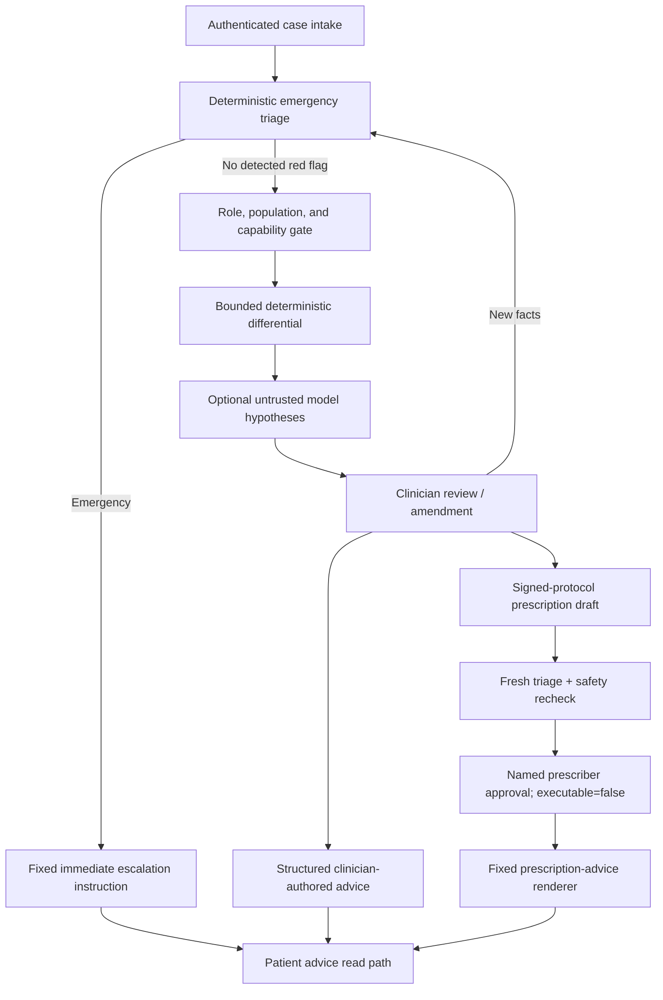

# Implementation status and release boundary

## v3 personal steward vertical slice

The repository also contains the v3 single-user, adult, non-pregnancy personal steward implementation. It includes the encrypted offline PWA, longitudinal event replay, deterministic TypeScript clinical kernel, signed preclinical cardiometabolic pack, encrypted relay, generic push scheduler/worker, consent-bound bounded model broker, transactional backup worker, and home-server deployment.

This is feature-complete as an engineering vertical slice, not clinically released. The included clinical pack is explicitly unapproved, the model path is disabled by default, and treatment, prescribing, dispatch, and clinician-monitoring claims remain prohibited. See [Personal Longitudinal Health Steward v3](PERSONAL_STEWARD_V3.md) for operation and remaining gates.

## Meaning of “implemented” here

All four requested capability paths execute end to end through typed API contracts, authorization, deterministic safety policy, case persistence, review transitions, immutable versions, and audit events. This is a **preclinical reference implementation**. “Implemented” does not mean clinically validated, licensed, or safe for unsupervised patient care.

Emergency triage is always evaluated first. An emergency suspends diagnosis support, prescription drafting, and routine advice. The optional model is downstream of deterministic triage and can modify only the non-authoritative differential.

## Capability matrix

| Capability | Executable behavior | Hard boundary | Evidence still required before clinical use |
|---|---|---|---|
| Emergency triage | Narrow symptom red flags, adult vital thresholds, explicit missing-data state, configurable emergency-service wording | No dispatch; no “safe” conclusion; pediatric cases without red flags remain insufficient | Clinician-owned rule set, jurisdiction/site validation, sensitivity and subgroup evaluation, human-factors testing |
| Diagnosis support | Adult-only bounded syndromic hypotheses, dangerous alternatives, evidence for/against, missing information, optional strict-JSON model augmentation | Never authoritative; patients cannot request it; emergency preemption cannot be overridden | Representative silent evaluation, calibration/error analysis, specialty scope, monitored release thresholds |
| Prescription drafting | Ed25519-verified protocol, mandatory medication/allergy reconciliation, known pregnancy status, clinician-confirmed snapshot and indication, contraindication/interaction/age checks | Empty protocol catalog by default; draft stays `executable=false`; no order or pharmacy transmission | Licensed drug knowledge, approved local protocols, renal/hepatic logic per protocol, formulary/site integration, prospective validation |
| Patient advice | Fixed emergency instruction, structured clinician-authored care plan, fixed rendering from an approved prescription draft | No autonomous non-emergency treatment generation | Reading-level/localization validation, accessibility testing, approved content library, communication monitoring |

## Cross-cutting controls implemented

- Deny-by-default case ACLs; clinical safety oversight is globally read-only.
- Per-capability role, age, pregnancy, output, and action envelopes.
- Startup failure when executed triage/diagnosis release labels or SHA-256 pins differ from the registry.
- Ed25519 signatures over canonical prescribing protocol records.
- Optimistic concurrency using snapshot and decision IDs; stale writes return HTTP 409.
- Fresh deterministic triage and prescribing-gate evaluation immediately before draft approval.
- Append-only SQLite triggers for clinical versions and audit records.
- Transactional audit outbox, local reference sink, and event hash-chain verification.
- Direct patient/encounter IDs and arbitrary attributes omitted from optional model requests.
- HTTPS/host/timeout controls for optional model egress; gateway disabled by default.
- Demonstration credentials limited to preclinical mode.

## Deliberate non-production components

The following are scaffolds, not production claims:

- Static bearer tokens instead of organization-managed OIDC/SMART authentication.
- SQLite and a same-database audit sink instead of a production datastore and independently controlled WORM audit destination.
- A deliberately empty prescribing protocol catalog.
- Small preclinical triage and diagnosis rule artifacts, not a validated clinical knowledge release.
- No EHR order entry, prescription signing/transmission, emergency dispatch, billing, or autonomous patient diagnosis.
- No clinical monitoring service, incident-management integration, model registry, or regulatory quality-system evidence package.

## Promotion gates

1. Name the jurisdiction, care setting, clinical owner, intended users, populations, exclusions, and legal manufacturer/service operator.
2. Replace reference authentication, storage, secrets, and local audit sink with approved infrastructure.
3. Release signed clinical knowledge and prescribing protocols through clinical safety and change-control governance.
4. Complete verification, security/threat testing, usability testing, silent prospective evaluation, subgroup analysis, and independent clinical review.
5. Define stop thresholds, rollback/kill-switch authority, incident response, post-deployment monitoring, and retention/privacy controls.
6. Obtain the required organizational, regulatory, and site approvals before any real-patient clinical use.

The architectural rationale, assurance cases, data contracts, and phased roadmap are specified in [AI Doctor OS — Blueprint v2](AI_DOCTOR_OS_BLUEPRINT_V2.md).
